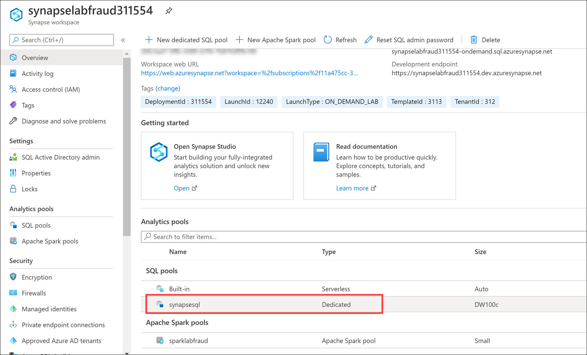
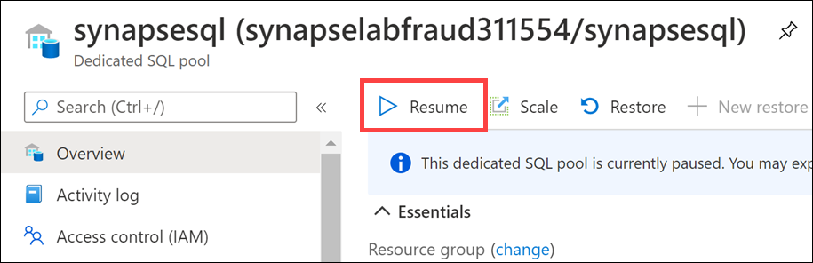
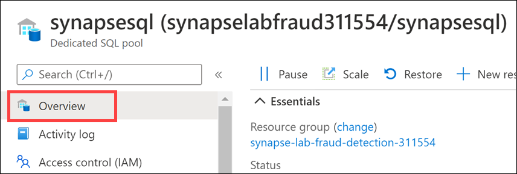
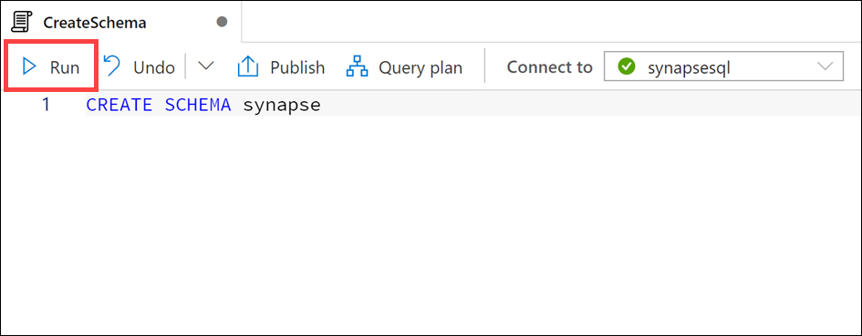
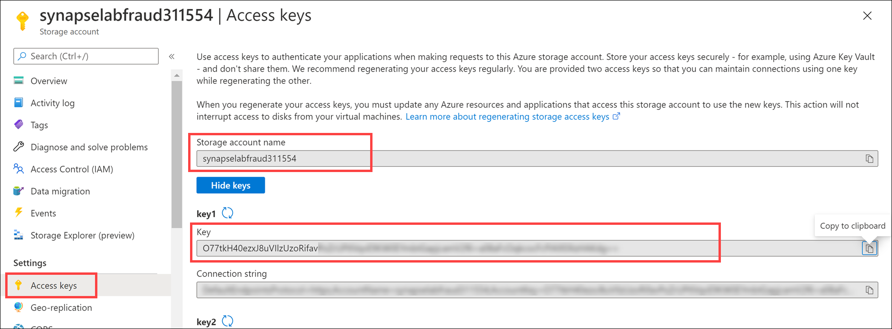
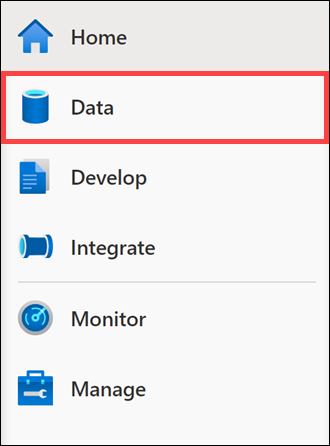
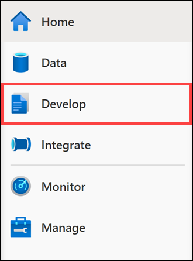
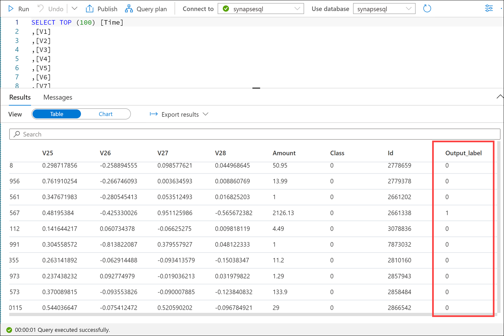
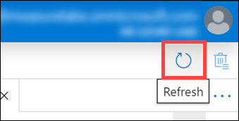

## Exercise 1:  Scoring predictions from T-SQL using a pre-trained model

Duration: 45 minutes

You will use masked data, obtained by applying principal component analysis to credit card transaction data, to evaluate which transactions are fraudulent and to analyze trends in elapsed time and fraud amounts.

### Task 1: Dataset Creation

1. In the [Azure portal](https://portal.azure.com), type in "azure synapse analytics" in the top search menu and then select **Azure Synapse Analytics** from the results.

    

2. Select the workspace you created before the hands-on lab, or that is provided by your hosted lab environment.

    

3. Select the `synapsesql` dedicated SQL pool on the Overview pane of the Synapse workspace.

    

4. If the dedicated SQL pool is currently paused, select **Resume**.

    

5. When prompted whether you are sure you want to resume the pool, select **Yes**.

6. Select **Overview** in the left-hand menu **after** the SQL pool resumes.

    

7. Select **Open** underneath **Open Synapse Studio** from the Synapse workspace page.

    

8. Select the **Develop** tab from Synapse studio.

    

9. From the **+** menu, choose **SQL script** to open a new script.

    

10. Choose the **synapsesql** connection option and the **synapsesql** database from the database drop-down list.

    

11. Change the name of the script to **CreateSchema**.

    

12. Enter the following code into the script window. Then, select **Run** to execute the code.

    ```sql
    CREATE SCHEMA synapse
    ```

    

13. From the **+** menu, choose **SQL script** to open a new script. Ensure that you are connected to the **synapsesql** SQL pool and the **synapsesql** database.

    

14. Change the name of this script to **CreateMasterKey**. Enter the following into the script window, changing `{Password}` to a password you can remember. Then, select **Run** to execute the code.

    ```sql
    CREATE MASTER KEY ENCRYPTION BY PASSWORD = '{Password}'
    ```

    

15. From the **+** menu, choose **SQL script** to open a new script.  Ensure that you are connected to the **synapsesql** SQL pool and the **synapsesql** database.

    

16. Change the name of this script to **CreateAzureStorageAccountKey**. Connect to the **synapsesql** dedicated SQL pool, then enter the following into the script window, filling in your storage account name and access key. Select **Run** to execute the code.

    ```sql
    CREATE DATABASE SCOPED CREDENTIAL AzureStorageAccountKey
    WITH IDENTITY = '<Your Storage Account>',
    SECRET = '<Your Access Key>';
    ```

    

    To find the storage account name and access key, navigate to the resource group for your lab and open the provisioned Azure storage account. Select **Access keys** in the left-hand menu. Here you can copy the **Storage account name** and paste it in place of `<Your Storage Account>` in the SQL script, and copy the **Key** to replace `<Your Access Key>` in the SQL script.

    

17. From the **+** menu, choose **SQL script** to open a new script.

    

18. Change the name of this script to **CreateCSVDataSource**. Enter the following into the script window, filling in your storage account name in place of `<Your Storage Account>`. Ensure that you are connected to the **synapsesql** SQL pool and the **synapsesql** database. Then, select **Run** to execute the code.

    ```sql
    CREATE EXTERNAL DATA SOURCE CSVDataSource WITH
    (
        TYPE = HADOOP,
        LOCATION = 'wasbs://synapse@<Your Storage Account>.blob.core.windows.net',
        CREDENTIAL = AzureStorageAccountKey
    );
    ```

    

19. From the **+** menu, choose **SQL script** to open a new script.

    

20. Change the name of this script to **CreateCSVFileFormat**. Enter the following into the script window to create two external file formats. One is for reading the source CSV files and the other is to read the machine learning (ML) model file. Ensure that you are connected to the **synapsesql** SQL pool and the **synapsesql** database. Then, select **Run** to execute the code.

    ```sql
    CREATE EXTERNAL FILE FORMAT CSVFileFormat
    WITH (  
        FORMAT_TYPE = DELIMITEDTEXT,
        FORMAT_OPTIONS (
            FIELD_TERMINATOR = ',',
            STRING_DELIMITER = '"',
            FIRST_ROW = 2,
            USE_TYPE_DEFAULT=TRUE
        )
    );
    GO

    CREATE EXTERNAL FILE FORMAT csv
    WITH (
        FORMAT_TYPE = DELIMITEDTEXT,
        FORMAT_OPTIONS (
            FIELD_TERMINATOR = ',',
            STRING_DELIMITER = '',
            DATE_FORMAT = '',
            USE_TYPE_DEFAULT = False
        )
    );
    GO
    ```

    

21. From the **+** menu, choose **SQL script** to open a new script.

    

22. Change the name of this script to **CreateExternalCreditCard**. Enter the following into the script window to create an external table for the credit card CSV data and an external table for the ML model. Ensure that you are connected to the **synapsesql** SQL pool and the **synapsesql** database. Then, select **Run** to execute the code.

    ```sql
    CREATE EXTERNAL TABLE synapse.exCreditCard
    (
            [Time] float,
            [V1] float,[V2] float,[V3] float,[V4] float,[V5] float,[V6] float,[V7] float,[V8] float,[V9] float,[V10] float,
            [V11] float,[V12] float,[V13] float,[V14] float,[V15] float,[V16] float,[V17] float,[V18] float,[V19] float,[V20] float,
            [V21] float,[V22] float,[V23] float,[V24] float,[V25] float,[V26] float,[V27] float,[V28] float,
            [Amount] float,[Class] bigint,[id] bigint
    )
    WITH
    (
            LOCATION = 'CreditCard.csv',
            DATA_SOURCE = [CSVDataSource],
            FILE_FORMAT = [CSVFileFormat]
    );
    GO

    CREATE EXTERNAL TABLE synapse.[MLModelExt]
    (
    [Model] [varbinary](max) NULL
    )
    WITH
    (
        LOCATION='credit_card_model.onnx.hex' ,
        DATA_SOURCE = [CSVDataSource] ,
        FILE_FORMAT = csv ,
        REJECT_TYPE = VALUE ,
        REJECT_VALUE = 0
    );
    GO
    ```

    

23. Select the **Data** hub in the left-hand menu.

    

24. Expand **Databases** under the Workspace tab, expand **synapsesql**, then expand **External tables**. Right-click on the **synapse.exCreditCard** table and choose **New SQL script** and then **Select TOP 100 rows**.

    

25. Select the **Properties** icon to display the menu. Rename the name to **SelectExternalCreditCard**. Then, select **Publish all**.

    

26. Select the **Publish** option to save these scripts.

    

### Task 2:  Query Development

1. Navigate to the **Develop** hub.

    

2. From the **+** menu, choose **SQL script** to open a new script.

    

3. Change the name of this script to **SelectIntoCreditCard**. Enter the following into the script window to create an external table for the credit card CSV data and an external table for the ML model. Ensure that you are connected to the **synapsesql** SQL pool and the **synapsesql** database. Then, select **Run** to execute the script and let it insert data into a new `synapse.CreditCard` table.

    ```sql
    DECLARE @modelexample varbinary(max) = (SELECT [Model] FROM synapse.[MLModelExt]);

    SELECT
    d.*, p.*
    INTO synapse.CreditCard
    FROM PREDICT(MODEL = @modelexample,
        DATA = synapse.exCreditCard AS d,
        RUNTIME = ONNX) WITH (output_label bigint) AS p;
    ```

    

4. In the **Tables** folder for **synapsesql**, select the ellipsis (...) and choose **Refresh** to see the `synapse.CreditCard` table.

    

5. In the **synapse.CreditCard** table entry, select the ellipsis (...) and choose **New SQL Script** and then **Select TOP 100 rows** to open a new script pre-populated with a SQL query.

    

    The `Output_label` field shows the prediction from the model.

    

### Task 3:  Power BI Report Development

1. Open the RDP file from the Before the Hands-On Lab section and select **Connect** to access the virtual machine.  When prompted for credentials, enter `powerbiuser` for the username and the password you chose, or which were provided to you in your hosted lab environment details.

    

2. Open a browser in the virtual machine.  In the [Azure portal](https://portal.azure.com), type in "azure synapse analytics" in the top search menu and then select **Azure Synapse Analytics** from the results.

    

3. Select the workspace you created before the hands-on lab.

    

4. Select **Open** underneath **Open Synapse Studio** from the Synapse workspace page.

    

5. Select the **Develop** hub.

    

6. Drill down into **Power BI** and then **FraudDetectionWorkspace**. Select **Power BI datasets**.

    

    If you do not see the **Power BI** section under Develop, select **Refresh** in the upper-right corner of Synapse Studio to refresh the UI.

    

7. Select **+ New Power BI dataset**.

    

8. Select **Start** to begin the process.

    

9. Select the **synapsesql** SQL pool to use as a data source and then select **Continue**.

    

10. Select **Download** to download the Power BI dataset file.  After download completes, select **Continue**.

    

11. Open the downloaded Power BI dataset file in Power BI Desktop.  When prompted to enter a username and password, select **Database** and enter the Synapse username and password you created before the hands-on lab, or which was provided to you as part of a hosted environment. The username will be **asa.sql.admin**. Then select **Connect** to connect to the SQL pool.

    

12. On the Navigator page, select the **synapse.CreditCard** table and then select **Load**.

    

13. In the Connection settings modal dialog, select **Import** and then select **OK**.

    

14. Once the table is loaded, select the **Data** tab and then select the **Time** column.  In the Format section, select the drop-down list and choose **Decimal number**.

    

15. Right-click the Time column and choose **Sort ascending**.

    

16. Choose the **Report** view and then select the **Clustered column chart** option.  Select and drag the **Time** attribute into the **Axis** field to make time the X axis.  From there, select and drag the **Amount** attribute into the **Values** field to make amount the Y axis.

    

17. Expand out the **Filters** pane. Select and drag the **Class** attribute into the **Filters on this visual** menu.  Change the filter type to **Basic filtering** and select **1** to filter down to fraudulent transactions.

    

18. Save the file as **FraudDetectionReport**.

    

19. In the **File** menu, select **Publish** and then **Publish to Power BI**.

    

20. Sign into your Power BI workspace.

    

21. Select the **FraudDetection** workspace and then choose **Select**.

    

22. After the Power BI report deploys, return to Azure Synapse Analytics Studio and select **Continue** and then **Close and refresh**.  Select the **Power BI reports** menu and then the **FraudDetectionReport** to review the published report.

    
