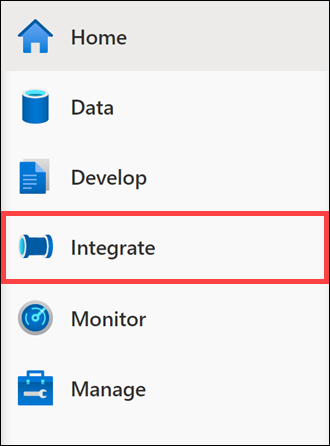
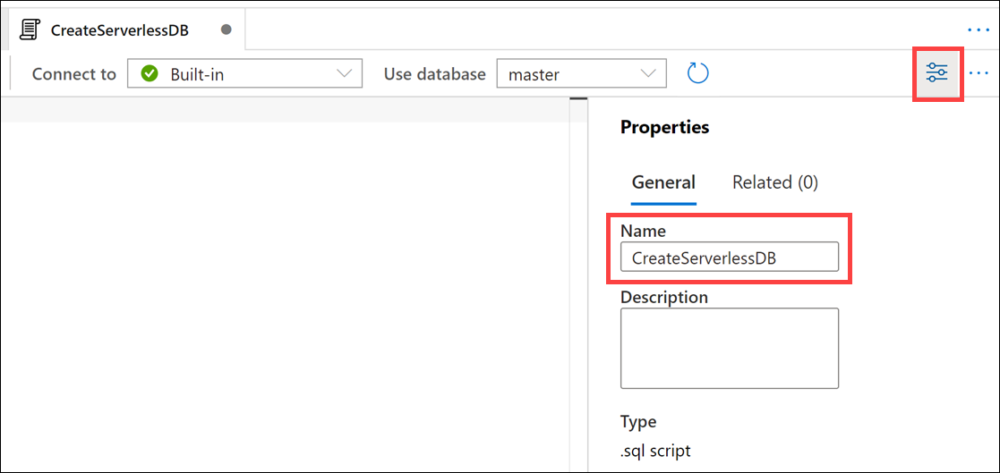
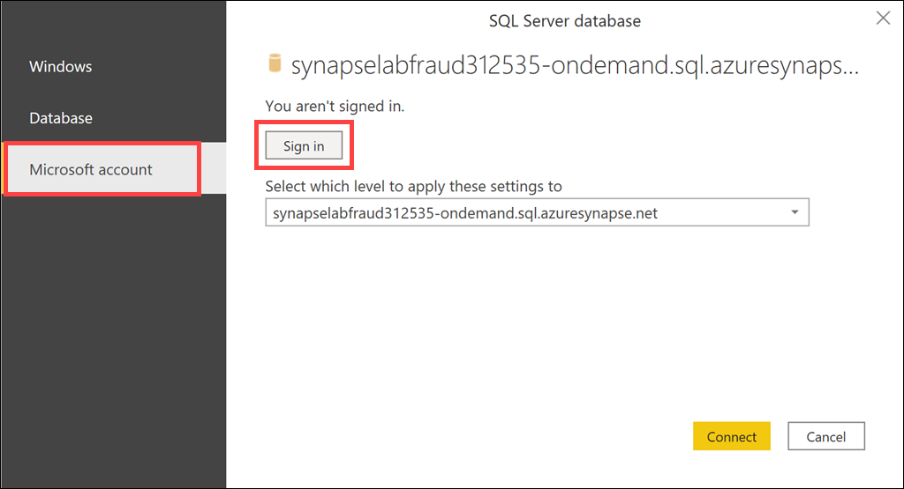
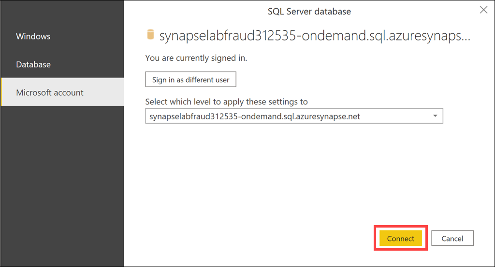
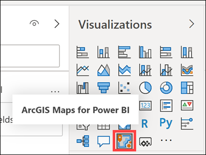

## Exercise 2:  Perform Ad Hoc Queries from the Storage Account

Duration: 50 minutes

Plot the trends of the cities where unauthorized use of credit cards occurred and the amounts on a map, so that you can ascertain the geographical factors associated with frequent unauthorized use and the cities where large losses frequently occur.

### Task 1:  Create a Dataset

This first task will export credit card predictions from the prior exercise into CSV format.

1. In the [Azure portal](https://portal.azure.com), type in "azure synapse analytics" in the top search menu and then select **Azure Synapse Analytics** from the results.

    

2. Select the workspace you created before the hands-on lab.

    

3. Select **Open** underneath **Open Synapse Studio** from the Synapse workspace page.

    

4. Select the **Manage** tab from Synapse studio.

    

5. Select the **Linked services** option from the External connections section. Then select **+ New** to add a new linked service.

    

6. Enter **synapse** into the search menu and select the **Azure Synapse Analytics (formerly SQL DW)** option. Then, select **Continue**.

    

7. In the **New linked service** tab, complete the following and then select **Create** to create a new linked service connection.

    | Field                           | Value                                              |
    | ------------------------------  | ------------------------------------------         |
    | Name                            | _`FraudDetectionSynapse`_                          |
    | Connect via integration runtime | _select `AutoResolveIntegrationRuntime`_           |
    | Account selection method        | _select `From Azure subscription`_                 |
    | Azure subscription              | _select your Azure subscription_                   |
    | Server name                     | _`synapselabfraud` + unique id (example: `synapselabfraud311554`)_ |
    | Database name                   | _select `synapsesql`_                              |
    | Authentication type             | _select `SQL authentication`_                      |
    | User name                       | _enter `asa.sql.admin`_                             |
    | Password                        | _enter the password you created earlier or that was provided to you for your hosted lab environment_           |

    

8. Select the **Data** tab from Synapse studio.

    

9. Drill down the SQL pool tables and then select the ellipsis (...) next to the **synapse.CreditCard** table.  From there, select **Data flow** to open a new data flow.

    

10. Name the data flow **DataflowCreditCard** and the integration dataset name **DatasetSqlPoolCreditCard**. Then, select **Create** to create the data flow.

    

11. Name the source **sourceCreditCard**.  Then select the **Open** option next to the Dataset.

    

12. In the Linked service menu, select **FraudDetectionSynapse**.  Then, in the Table menu, select **synapse.CreditCard**.

    

13. Select the **DataflowCreditCard** tab to return to the data flow.  Then, select the **+** option next to the source and choose **Select** from the Schema modifier list.

    

14. Change the name of the new output stream to **SelectCreditCard**.

    

15. Select the **+** option next to the source and choose **Sink** from the Destination list.

    

16. Change the name of the new output stream to **SinkCreditCard**.  Then select the **+ New** option to create a new Dataset.

    

17. From the New integration dataset menu, select **Azure Data Lake Storage Gen2** and then select **Continue**.

    

18. On the Select format menu, choose **DelimitedText** for the output type and then select **Continue**.

    

19. Enter **outputCreditCardCSV** as the file name.  Then, from the Linked service menu, choose **+ New**.

    

20. In the **New linked service** menu, complete the following and then select **Create** to create a new Azure Data Lake Storage Gen2 linked service.

    | Field                          | Value                                              |
    | ------------------------------ | ------------------------------------------         |
    | Name                           | _`SynapseLabFraudADLS`_ |
    | Authentication method          | _select `Account key`_                             |
    | Account selection method       | _select `From Azure subscription`_                 |
    | Azure subscription             | _select your Azure subscription_                   |
    | Storage account name           | _`synapselabfraud` + unique id (example: `synapselabfraud312535`)_ |

    

21. In the Set properties menu, in the File path section, enter **synapse** into the **File System** box.  Then, select the **First row as header** option and select **OK**.

    

22. Enable data flow debugging by toggling the **Data flow debug** option.

    

23. Choose the **AutoResolveIntegrationRuntime** integration runtime, select **1 hour** for time to live, and select **OK**. It may take several minutes for setup to complete.

    

24. After the debugger starts, select **Publish all**.

    

25. Select the **Publish** option to save your changes.

    

26. Navigate to the **Integrate** hub.

    

27. Select **+** and then choose **Pipeline** to create a new pipeline.

    

28. Set the name of the pipeline to **PipelineCreditCard**.

    

29. Drill down into the **Move & transform** menu and bring a **Data flow** onto the canvas.

    

30. In the Adding data flow tab, select **DataflowCreditCard** from the Existing data flow drop-down list.  Then, select **OK** to continue.

    

31. Select the data flow and then navigate to the **Settings** menu.  In the PolyBase sub-menu, change the Staging linked service to **SynapseLabFraudADLS**, the staging storage folder's container to **synapse** and folder to **creditcard**.

    

32. Select **Debug** to run the pipeline.

    

33. Wait until the Output tab has a **Succeeded** status message. You may need to periodically select the **Refresh** button to view the updated status.

    

34. Select the **Data** tab from Synapse studio.

    

35. Navigate to the **synapselabfraud###asws** option and navigate to **synapse (Primary)**.  In the root directory, there will be two files which start with **part-00001-**.  Right-click on the file which is 101.2 MB and choose **Rename**.

    

36. Change the file name to **CreditCardScored.csv** and select **Apply**.

    

37. Right-click on the **CreditCardScored.csv** file and select **Preview**.

    

38. Ensure that the **CreditCardScored.csv** file has the correct shape.

    

### Task 2:  Create a View

1. Select the **Develop** tab from Synapse studio.

    

2. From the **+** menu, choose **SQL script** to open a new script.

    

3. Ensure that you are connected to the **Built-in** option. Then, enter the following script into the script window and select **Run**.

    ```sql
    CREATE DATABASE synapse
    ```

    

4. Change the name of the script in the properties to **CreateServerlessDB**.

    

5. From the **+** menu, choose **SQL script** to open a new script.

    

6. Ensure that you are connected to the **Built-in** option. Then, in the Use database drop-down, select **synapse**.

    

7. Change the name of the script to **CreateViewCreditCardLonLat**.

    

8. Copy and paste the following into the script window. Change the three `synapselabfraud###` references to the primary ADLS Gen2 storage account for the Synapse workspace. Then select **Run** to execute the script.

    ```sql
    CREATE VIEW dbo.CreditCardLonLat AS
    SELECT
            credit.Time,
            city.name,
            city.lon,
            city.lat,
            city.alpha2,
            country.companyen,
            credit.V1,
            credit.V2,
            credit.V3,
            credit.V4,
            credit.V5,
            credit.V6,
            credit.V7,
            credit.V8,
            credit.V9,
            credit.V10,
            credit.V11,
            credit.V12,
            credit.V13,
            credit.V14,
            credit.V15,
            credit.V16,
            credit.V17,
            credit.V18,
            credit.V19,
            credit.V20,
            credit.V21,
            credit.V22,
            credit.V23,
            credit.V24,
            credit.V25,
            credit.V26,
            credit.V27,
            credit.V28,
            credit.Amount,
            credit.Class,
            credit.id
    FROM
    OPENROWSET(
            BULK 'https://synapselabfraud###.blob.core.windows.net/synapse/CreditCardScored.csv',
            FORMAT = 'CSV',
            FIELDTERMINATOR =',',
            FIRSTROW = 2,
            ESCAPECHAR = '\\'
        )
        WITH (
            [Time] float,
            [V1] float,[V2] float,[V3] float,[V4] float,[V5] float,[V6] float,[V7] float,[V8] float,[V9] float,[V10] float,
            [V11] float,[V12] float,[V13] float,[V14] float,[V15] float,[V16] float,[V17] float,[V18] float,[V19] float,[V20] float,
            [V21] float,[V22] float,[V23] float,[V24] float,[V25] float,[V26] float,[V27] float,[V28] float,
            [Amount] float,[Class] int,[id] varchar(20)
        ) AS [credit]
    LEFT JOIN
    OPENROWSET(
            BULK 'https://synapselabfraud###.dfs.core.windows.net/synapse/CityList.csv',
            FORMAT = 'CSV',
            FIELDTERMINATOR =',',
            FIRSTROW = 2,
            ESCAPECHAR = '\\'
        )
        WITH (
            [id] VARCHAR (20) ,
            [name] VARCHAR (100) COLLATE Latin1_General_100_CI_AI_SC_UTF8,
            [state] VARCHAR (10) ,
            [alpha2] VARCHAR (2) ,
            [lon] float,
            [lat] float
        ) AS [city] ON
        credit.id = city.id
    LEFT JOIN
    OPENROWSET(
            BULK 'https://synapselabfraud###.dfs.core.windows.net/synapse/CountryList.csv',
            FORMAT = 'CSV',
            FIELDTERMINATOR =',',
            FIRSTROW = 2,
            ESCAPECHAR = '\\'
        )
        WITH (
            [companyjp] VARCHAR (20) COLLATE Latin1_General_100_CI_AI_SC_UTF8,
            [companyen] VARCHAR (100) COLLATE Latin1_General_100_CI_AI_SC_UTF8,
            [numeric] decimal,
            [alpha3] VARCHAR (3) ,
            [alpha2] VARCHAR (2) ,
            [location] VARCHAR (100) COLLATE Latin1_General_100_CI_AI_SC_UTF8,
            [subvivision] VARCHAR (15) COLLATE Latin1_General_100_CI_AI_SC_UTF8
        ) AS [country] ON
        city.alpha2 = country.alpha2
    ```

### Task 3:  Power BI Fraud Map Report Development

1. Open the RDP file from the Before the Hands-On Lab section and select **Connect** to access the virtual machine.  When prompted for credentials, enter `powerbiuser` for the username and the password you chose.

    

2. Open a browser in the virtual machine.  In the [Azure portal](https://portal.azure.com), type in "azure synapse analytics" in the top search menu and then select **Azure Synapse Analytics** from the results.

    

3. Select the workspace you created before the hands-on lab.

    

4. Select **Open** underneath **Open Synapse Studio** from the Synapse workspace page.

    

5. Select the **Develop** tab from Synapse studio.

    

6. Drill down into the **Power BI** menu and then the **FraudDetection** menu, followed by **Power BI datasets**.  Choose the **+ New Power BI dataset** option.

    

7. Hover over the **synapsesql** serverless SQL database and then select **Download .pbids file**.

    

8. Open the downloaded Power BI dataset file in Power BI Desktop. If you are prompted to sign in to the Power BI dataset, select **Microsoft account** in the left-hand menu, then click the **Sign in** button to enter your Azure credentials.

    

9. After signing in with your Azure credentials, click **Connect**.

    

10. On the Navigator page, select the **CreditCardLonLat** view and then select **Load**.

    

11. In the Connection settings modal dialog, select **Import** and then select **OK**.

    

12. Select the **lat** column. In the **Column tools** tab, select the drop-down for Summarization and select **Don't summarize**. Select the drop-down for Data category and choose **Latitude**. Repeat this for the **lon** column, setting the Data category to **Longitude** and Summarization to **Don't summarize**.

    

13. Select the **ArcGIS Maps for Power BI** visualization and drag it onto the canvas. Expand it to fill the canvas.

    

    > **Note**: You do not need to sign in to the ArcGIS service.

14. Drag the **Amount** data field into `Size` and `Color`, the **lat** data field into `Latitude`, and the **lon** data field into `Longitude`.

    

15. Drag the **Class** data field into the **Filters on this visual** section. In the Filter type drop-down, select **Basic filtering**.

    

16. Change the filter on **Class** to include only fraudulent transactions by checking the **1 checkbox**. This report allows you to understand the geographical features of the unauthorized use of credit cards and to implement concrete measures to temporarily restrict the use of credit cards in cities that show the beginnings of a concentration of unauthorized uses of credit cards for large amounts.

    
