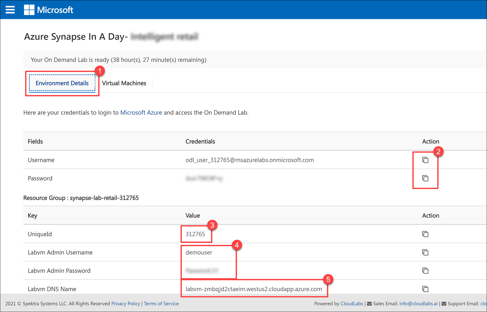
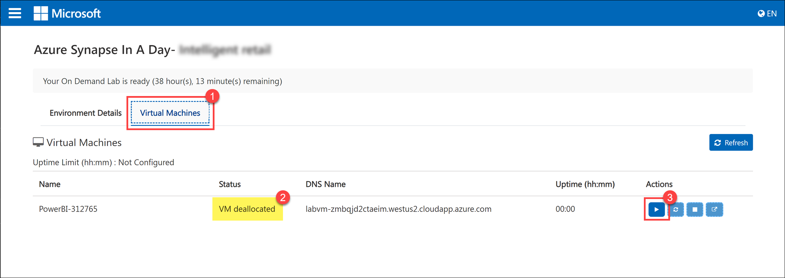

## Pre-Requisites

**Please note**: If you are not running this lab in a hosted environment, complete the [lab setup instructions](Setup.md) before continuing.

- Power BI Pro or Premium license. You may try Pro free for 60 days if you have not previously signed up for a free trial.

### Hosted lab environment

If you are using a hosted CloudLabs lab environment, you will find your environment details in the email address you provided during registration. You can also find the information by selecting the **Environment Details** tab **(1)** on the landing page for the `Azure Synapse in A Day - Fraud detection` lab.

Use the buttons **(2)** to copy your username and password when prompted to log in to the Azure portal and Power BI account. The **UniqueId (3)** is referenced throughout the lab guide and is used as part of resource naming for the Azure artifacts. When you need to sign in to the lab VM, use the provided **VM username and password (4)** after connecting to the **VM DNS name (5)** with your remote connection application, such as RDP.

When you need to log in to the lab VM, select the **Virtual Machines** tab **(1)** and check the VM status **(2)**. If the VM is **deallocated**, you must start it by selecting the **Start** button **(3)** under Actions.

